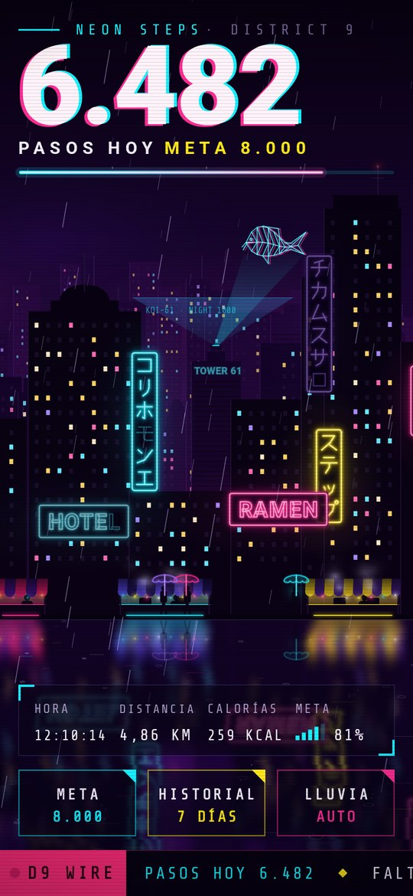
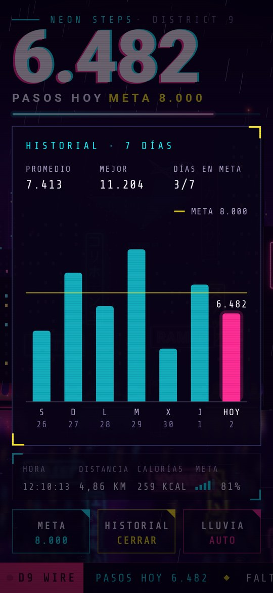
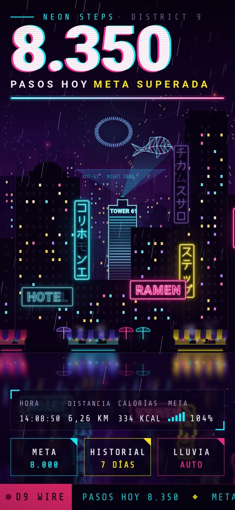

# Neon Steps

Contador de pasos para Android ambientado en el mercado nocturno de **District 9**: una calle
cyberpunk renderizada en vivo, con lluvia, neones que fallan y un koi holográfico, y tus pasos
del día como título en neón.

<p>
  
  
  
</p>

## Instalar

1. Descarga [`dist/NeonSteps.apk`](dist/NeonSteps.apk) en el móvil (Android 8.0 o superior).
2. Ábrela y permite «Instalar apps de origen desconocido» cuando lo pida.
3. Al abrir la app, concede **Actividad física** (necesario para contar pasos) y
   **Notificaciones** (para ver el contador en la barra de estado).

La APK está firmada con una clave de depuración: si más adelante instalas una versión
compilada en otro ordenador, desinstala antes la anterior.

## Qué hace

- **Pasos de hoy** como título gigante con aberración cromática, más un tubo de neón con el
  progreso hacia la meta.
- **HUD**: hora local, distancia, calorías y barras de «señal» con el % de la meta.
- **META**: toca para cambiar la meta diaria (4.000 – 20.000 pasos).
- **HISTORIAL**: últimos 7 días con la línea de meta; toca una columna para ver su valor.
- **LLUVIA**: AUTO (llueve más fuerte cuanto más rápido caminas), llovizna, lluvia o aguacero.
- **Desliza el dedo** de lado a lado para recorrer la calle: cada capa de edificios se mueve a
  su propia velocidad (las lejanas apenas, el mercado más que nada) y al soltar vuelve sola.
- Cada 1.000 pasos cae un relámpago. Toca la calle para invocar uno.
- **Al llegar a la meta**:
  - Doble relámpago y una salva de fuegos artificiales. Si la app estaba cerrada, la
    celebración se reproduce la primera vez que la abras ese día.
  - Llega un aviso «¡META CUMPLIDA!» con sonido, una sola vez al día (si tienes la app abierta,
    la celebración se ve en pantalla y no hace falta el aviso).
  - La Torre 61 se enciende planta a planta en neón y se queda iluminada.
  - Fuegos artificiales en el cielo, detrás de los edificios, hasta medianoche.
- El noticiero **D9 WIRE** comenta tu caminata (y el letrero del HOTEL, que sigue sin su «L»).
- Inclinar el móvil también desplaza un poco las capas.

## Cómo cuenta

- Usa el **podómetro de hardware** (`TYPE_STEP_COUNTER`) desde un servicio en primer plano
  con notificación, así sigue contando con la pantalla apagada y gasta muy poca batería.
- El total sobrevive a reinicios del móvil y a que el sistema cierre la app: el contador de
  hardware es acumulativo y la app recupera la diferencia al volver.
- Los pasos se cuentan desde la instalación; el día cambia a medianoche (hora local).
- Si el móvil no tiene podómetro, usa el detector de pasos y, como último recurso, el
  acelerómetro (que solo cuenta con la pantalla encendida).
- Distancia y calorías son estimaciones: zancada de 0,75 m y 0,04 kcal por paso.

## Compilar

Requiere JDK 17+ y el Android SDK (plataforma 36).

```sh
./gradlew assembleRelease          # APK en app/build/outputs/apk/release/
./gradlew testDebugUnitTest        # tests + capturas en app/build/screenshots/
```

Los tests usan Robolectric con gráficos nativos para renderizar la pantalla real en el JVM y
guardar capturas PNG, de modo que la escena se puede revisar sin dispositivo. GitHub Actions
compila la APK en cada push (artefacto `neon-steps-apk`).

## Estructura

| Ruta | Contenido |
|---|---|
| `data/StepRepository.kt` | Pasos por día, cambio de día, reinicios del sensor, ritmo |
| `service/StepCounterService.kt` | Servicio en primer plano que mantiene el sensor activo |
| `ui/scene/` | La calle: skyline en paralaje, letreros de neón, koi, mercado, lluvia, reflejo mojado |
| `ui/hud/` | Cabecera, HUD, botones, historial y noticiero |

## Créditos

Tipografías de Google Fonts: Roboto y Share Tech Mono, ambas bajo la SIL Open Font License 1.1.
